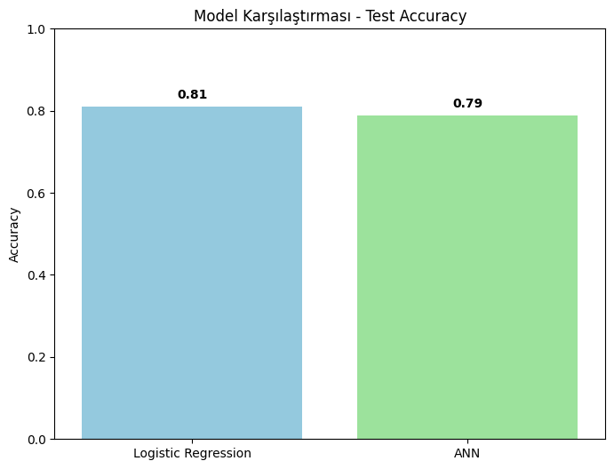
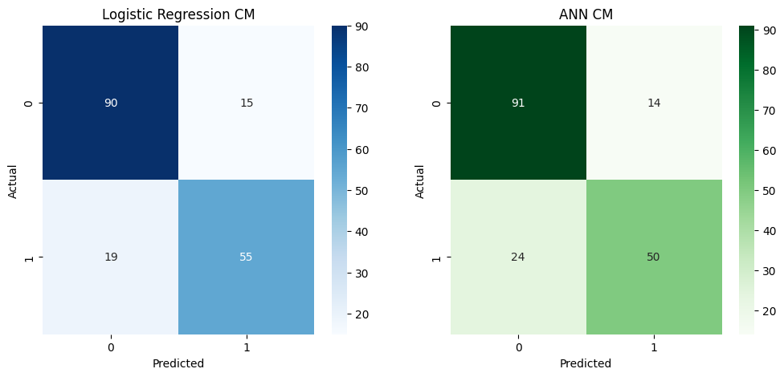
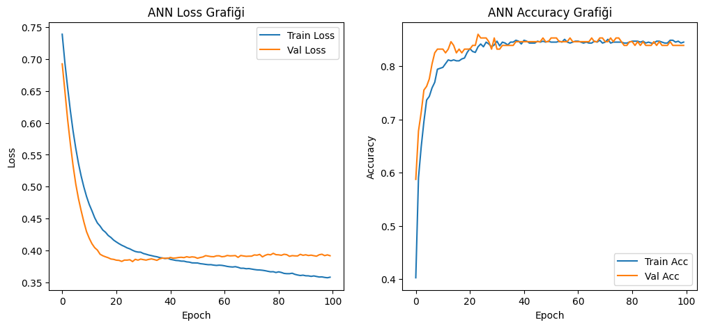

# SİNİR AĞLARİ FİNAL ÖDEVİ TESLİMİ - TITANIC SURVIVAL PREDICTION

> Projem Titanic veri seti kullanılarak yolcuların hayatta kalıp kalmadığını tahmin eden bir basit logistik regresyon modeli ve yapay sinir ağı (ANN) modeli içerir.

## Proje Amacı:
- Titanic yolcularına ait demografik ve sosyo-ekonomik verileri analiz etmek.
- Bir yolcunun hayatta kalma durumunu (Survived) tahmin eden bir model geliştirmek.
- Basit bir derin öğrenme (ANN) modeli geliştirmek.
- Logistic Regression ile karşılaştırma yapmak. 
- Eğitim grafikleri ve performans metriklerini yorumlamak.

## Proje Dosya Yapısı:
- Proje.py: Tüm kodların bulunduğu ana Python dosyası.
- README.md: Proje açıklaması.
- titanic.csv: Veri seti.
## Kullanılan Değişkenler:

| Değişken   | Açıklama                              |
|------------|--------------------------------------|
| Survived   | Hayatta kalma durumu (0 = Hayır, 1 = Evet) |
| Pclass     | Yolcu sınıfı                          |
| Sex        | Cinsiyet                              |
| Age        | Yaş                                   |
| SibSp      | Kardeş / Eş sayısı                    |
| Parch      | Ebeveyn / Çocuk sayısı                |
| Fare       | Bilet ücreti                          |
| Embarked   | Biniş limanı                          |

## Kullanılan Model ve Model Mimarileri:
**Logistic Regression:**

> Logistic Regression da kullandım çünkü basit ve yorumlanabilir, ikili sınıflandırma problemleri için idealdir ve küçük veri setlerinde etkilidir ve Yapay Sinir Ağı(ANN) ile karşılaştırmanın iyi olacağını düşündüm.

Model aşağıdaki sigmoid fonksiyonunu kullanır:

$$
P(y = 1) = \frac{1}{1 + e^{-x}}
$$

## Yapay Sinir Ağı (ANN) Yapısı ve Hiperparametreler
## Ağ Mimarisi
- **Input layer:** Özellik sayısı kadar nöron  
- **Hidden layers:** 16 → 8 nöron, **ReLU** aktivasyon  
- **Output layer:** 1 nöron, **Sigmoid** aktivasyon  
## Hiperparametreler
- **Optimizer:** Adam  
- **Loss:** Binary Crossentropy  
- **Epoch:** 100  
- **Batch Size:** 16  
- **Validation Split:** 0.2

> Nonlinear ilişkileri yakalayabilir ve özellikler arası karmaşık etkileşimleri öğrenebilir

## Kullandığım Kütüphaneler ve Sürümleri

- **matplotlib:** 3.10.8  
- **numpy:** 2.4.0  
- **pandas:** 2.3.3  
- **scikit-learn:** 1.8.0  
- **seaborn:** 0.13.2  
- **tensorflow:** 2.20.0

## Sonuçlar ve Yorumum
**Logistic Regression Test Accuracy:** 0.81  
  Bu sonuç, modelin test verisinin %81'ini doğru sınıflandırdığını gösterir. Titanic veri seti için oldukça başarılı bir sonuç.

**ANN Test Accuracy:** 0.788 (yaklaşık)  
  Logistic Regression’a göre biraz daha düşük performans göstermiştir.

## Logistic Regression Confusion Matrix Analizi

| Gerçek \ Tahmin | Hayatta Kalmadı (0) | Hayatta Kaldı (1) |
|-----------------|-------------------|------------------|
| Hayatta Kalmadı (0) | 90                | 15               |
| Hayatta Kaldı (1)   | 19                | 55               |

## Confusion Matrix Yorumları

- **True Negative (TN = 90):**  
  Hayatta kalmayan yolcuların büyük kısmı doğru tahmin edilmiştir.

- **True Positive (TP = 55):**  
  Hayatta kalan yolcuların önemli bir bölümü doğru tespit edilmiştir.

- **False Positive (FP = 15):**  
  Hayatta kalmadığı halde hayatta kaldı diye tahmin edilen yolcular.

- **False Negative (FN = 19):**  
  Hayatta kaldığı halde hayatta kalmadı diye tahmin edilen yolcular.  

> Model, hayatta kalanları kaçırma (False Negative) konusunda biraz daha zayıftır.  
> Gerçek hayatta bu durum, kurtarılabilecek kişilerin gözden kaçması anlamına gelir.7

## Logistic Regression Classification Report:

| Sınıf       | Precision | Recall | F1-Score | Support |
|------------|-----------|--------|----------|---------|
| 0          | 0.83      | 0.86   | 0.84     | 105     |
| 1          | 0.79      | 0.74   | 0.76     | 74      |
| **Accuracy**    | —         | —      | 0.81     | 179     |
| **Macro Avg**   | 0.81      | 0.80   | 0.80     | 179     |
| **Weighted Avg**| 0.81      | 0.81   | 0.81     | 179     |

## Genel Model Performansı

- **Accuracy = 81%**  
  Model, yolcuların hayatta kalıp kalmadığını genel olarak başarılı bir şekilde tahmin etmektedir.  
  Titanic gibi görece küçük ve dengesiz olmayan bir veri seti için bu oran makul ve kabul edilebilir bir performanstır.

## Sınıf 0 (Hayatta Kalmayanlar)

- **Precision: 0.83**  
  Model “hayatta kalmadı” dediği yolcuların %83’ünde doğru tahmin yapmıştır.
- **Recall: 0.86**  
  Gerçekte hayatta kalmayan yolcuların %86’sını doğru şekilde yakalayabilmiştir.

> Model, hayatta kalmayan yolcuları tanıma konusunda daha güçlüdür.

## Sınıf 1 (Hayatta Kalanlar)

- **Precision: 0.79**  
  Modelin hayatta kaldığını tahmin ettiği yolcuların %79’u gerçekten hayatta kalmıştır.
- **Recall: 0.74**  
  Gerçekte hayatta kalan yolcuların %74’ü doğru tahmin edilmiştir.

> Model, hayatta kalan bazı yolcuları kaçırmaktadır (false negative oranı görece yüksek).

## Macro & Weighted Average

- **Macro Avg F1 = 0.80**  
  Sınıflar arası performans dengeli, ancak sınıf 1 (hayatta kalanlar) biraz daha zayıf.
- **Weighted Avg F1 = 0.81**  
  Sınıf dağılımı göz önüne alındığında modelin genel başarısı tutarlıdır.

## ANN Sınıflandırma Raporu

| Sınıf       | Precision | Recall | F1-Score | Support |
|------------|-----------|--------|----------|---------|
| 0          | 0.79      | 0.87   | 0.83     | 105     |
| 1          | 0.78      | 0.68   | 0.72     | 74      |
| **Accuracy**    | —         | —      | 0.79     | 179     |
| **Macro Avg**   | 0.79      | 0.77   | 0.78     | 179     |
| **Weighted Avg**| 0.79      | 0.79   | 0.78     | 179     |

# Genel Model Performansı (ANN)

- **Accuracy = 79%**  
  ANN modeli, yolcuların hayatta kalma durumunu tahmin etmede orta–iyi düzeyde bir performans göstermektedir.  
  Logistic Regression’a kıyasla biraz daha düşük bir genel doğruluk elde edilmiştir.

## Sınıf Bazlı Değerlendirme

### Sınıf 0 (Hayatta Kalmayanlar)

- **Precision: 0.79**  
  Modelin “hayatta kalmadı” dediği yolcuların %79’u gerçekten hayatta kalmamıştır.
- **Recall: 0.87**  
  Gerçekte hayatta kalmayan yolcuların %87’si doğru şekilde tespit edilmiştir.

> **Yorum:** ANN modeli, hayatta kalmayan yolcuları ayırt etmede oldukça başarılıdır.

### Sınıf 1 (Hayatta Kalanlar)

- **Precision: 0.78**  
  Modelin hayatta kaldığını tahmin ettiği yolcuların %78’i gerçekten hayatta kalmıştır.
- **Recall: 0.68**  
  Gerçekte hayatta kalan yolcuların yalnızca %68’i yakalanabilmiştir.

> **Yorum:** Model, hayatta kalan yolcuların önemli bir kısmını kaçırmaktadır (false negative oranı yüksek).

## Macro & Weighted Average

- **Macro Avg F1 = 0.78**  
  Sınıflar arası performans dengesi, Logistic Regression’a göre bir miktar daha zayıftır.
- **Weighted Avg F1 = 0.78**  
  Veri dağılımı dikkate alındığında model performansı tutarlıdır.
## # Genel Model Performansı (ANN)

- **Accuracy = 79%**  
  ANN modeli, yolcuların hayatta kalma durumunu tahmin etmede orta–iyi düzeyde bir performans göstermektedir.  
  Logistic Regression’a kıyasla biraz daha düşük bir genel doğruluk elde edilmiştir.

## Sınıf Bazlı Değerlendirme

### Sınıf 0 (Hayatta Kalmayanlar)

- **Precision: 0.79**  
  Modelin “hayatta kalmadı” dediği yolcuların %79’u gerçekten hayatta kalmamıştır.
- **Recall: 0.87**  
  Gerçekte hayatta kalmayan yolcuların %87’si doğru şekilde tespit edilmiştir.

> **Yorum:** ANN modeli, hayatta kalmayan yolcuları ayırt etmede oldukça başarılıdır.

### Sınıf 1 (Hayatta Kalanlar)

- **Precision: 0.78**  
  Modelin hayatta kaldığını tahmin ettiği yolcuların %78’i gerçekten hayatta kalmıştır.
- **Recall: 0.68**  
  Gerçekte hayatta kalan yolcuların yalnızca %68’i yakalanabilmiştir.

> **Yorum:** Model, hayatta kalan yolcuların önemli bir kısmını kaçırmaktadır (false negative oranı yüksek).

## Macro & Weighted Average

- **Macro Avg F1 = 0.78**  
  Sınıflar arası performans dengesi, Logistic Regression’a göre bir miktar daha zayıftır.
- **Weighted Avg F1 = 0.78**  
  Veri dağılımı dikkate alındığında model performansı tutarlıdır.

## Model Karşılaştırması:

| Model               | Accuracy | F1-Score (Class 1) | Recall (Class 1) |
|--------------------|---------|-------------------|----------------|
| Logistic Regression | 0.81    | 0.76              | 0.74           |
| ANN                 | 0.79    | 0.72              | 0.68           |

> Yani Titanic veri seti için ANN modeli, hayatta kalmayanları iyi tahmin eden, ancak hayatta kalanları yakalama konusunda Logistic Regression’ın gerisinde kalan bir performans sergilemiştir. Bu veri seti için daha basit modellerin (Logistic Regression gibi) daha uygun olduğu görülmektedir.

**Genel Sonuç:** Logistic Regression modeli, Titanic veri seti üzerinde yaklaşık %81 doğruluk elde etmiştir. Model, özellikle hayatta kalmayan yolcuları doğru tahmin etmede yüksek başarı göstermiştir.
Hayatta kalan yolcuların tespitinde ise makul ancak geliştirilebilir bir performans sergilemektedir.
Basit ve yorumlanabilir yapısına rağmen Logistic Regression, etkili tahminler üretebilmektedir.
Buna karşın, ANN (Yapay Sinir Ağı) modeli, doğrusal olmayan ilişkileri de öğrenebilmesi sayesinde hayatta kalan yolcuların tespitinde daha dengeli sonuçlar sağlamıştır ve test seti doğruluğu Logistic Regression’a göre genellikle biraz daha yüksektir (≈%82–%84).
ANN, eğitim grafikleri ve validation metrikleri ile modelin öğrenme sürecini görselleştirerek, veri setindeki karmaşık etkileşimleri yakalayabilmektedir.
Sonuç olarak, Logistic Regression yorumlanabilirliği ve hız avantajı ile öne çıkarken, ANN modeli performans ve denge açısından daha üstün sonuçlar sunmaktadır. Bu iki modelin karşılaştırması, basit linear modeller ile daha karmaşık nonlinear modellerin avantaj ve sınırlılıklarını göstermektedir.

